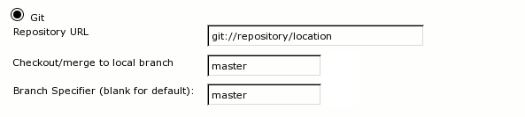

Git Setup
=========

Jenkins
-------

The ``jenkins-makejobs-git`` script works with template jobs
configured with the `Git SCM`_ plugin. The relevant options that must
be set are:

The script will take care of setting the correct branch specifier (the
branch that the job should checkout) and the name of the local branch
for every new job created from the template job.

.. note::

   Although the name of the local branch is always the same as the
   name of the shortref, future versions of ``jenkins-autojobs`` may
   allow further customization.

.. _gityamlconfig:

Config file
-----------

.. literalinclude:: git-config.yaml
   :language: yaml
.. :linenos:

:download:`Download git-config.yaml <git-config.yaml>`

``repo``
********

The location of the git repository.

If this is a local directory, ``jenkins-makejobs-git`` will use ``git
show-ref`` to list refs. If location is an url, ``git ls-remote`` will
be used. Keep in mind that these return ref names differently - this
is important for the refs_ option.

.. code-block:: bash

    # in a clone
    $ git show-ref | head -5 | awk '{print $2}'
    refs/heads/master
    refs/remotes/origin/0.3-maintenance
    refs/remotes/origin/0.5-maintenance
    refs/remotes/origin/0.6-maintenance
    refs/remotes/origin/0.7-maintenance

    # remotely
    $ git ls-remote https://github.com/mitsuhiko/flask.git | head -5 | awk '{print $2}'
    HEAD
    refs/heads/0.3-maintenance
    refs/heads/0.5-maintenance
    refs/heads/0.6-maintenance
    refs/heads/0.7-maintenance

``namefmt``
***********

Template string to use for job names.

Given a ref ``refs/heads/feature/one/two.three``, the following table
maps the available placeholders to their respectful values:

=====================     =======================================
 placeholder                   value
=====================     =======================================
 ``{shortref}``             ``feature-one.two.three``
 ``{shortref-orig}``        ``feature/one/two.three``
 ``{ref}``                  ``refs-heads-feature-one-two.three``
 ``{ref-orig}``             ``refs/heads/feature/one/two.three``
 ``{0}``                    ``one``
 ``{1}``                    ``two.three``
=====================     =======================================

Assumes that the following config:

.. code-block:: yaml

    refs:
      - 'refs/heads/feature/(.*)/(.*)':
        namesep: '-'

Placeholders such as ``{0} {1} {2}`` evaluate to the
backreferences (``\1 \2 \3``) of the matching regular expression (see refs_).

.. note::

   Using ``shortref-orig`` and ``ref-orig`` would most likely result
   in an error, since some of the characters allowed in branch names
   cannot be used for job names.

``refs``
********

A list of regular expressions that specify which refs to process:

.. code-block:: yaml

    refs:
      - 'refs/heads/feature/.*'
      - 'refs/heads/release/.*'

Global settings can be overwritten on a per-ref basis:

.. code-block:: yaml

    namefmt:  'job-{shortref}'
    template: 'template-one'

    refs:
      - 'refs/heads/feature/.*'
      - 'refs/heads/release/(.*)':
          namefmt:  'release-{1}'
          template: 'release-template'

=============================  ======================  ========================
ref                            new job name            template
=============================  ======================  ========================
``refs/heads/feature/bug1``    ``job-feature-bug1``    ``template-one``
``refs/heads/release/three``   ``release-three``       ``release-template``
=============================  ======================  ========================

Note that the namefmt_ setting can use backreferences from the regular
expressions through the ``{n}`` placeholder:

.. code-block:: yaml

    refs:
      - 'refs/heads/feature/(.*)/(.*)/(.*)'

Given a ref ``refs/heads/feature/alpha/beta/gamma`` the placeholders
will be expanded as:

=============================  ======================
placeholder                    value
=============================  ======================
``{0}``                        ``alpha``
``{1}``                        ``beta``
``{2}``                        ``gamma``
=============================  ======================

Defaults to:

.. code-block:: yaml

    refs:
      - '.*'

.. note::

   Although you can match any ``ref`` returned by ``git show-ref`` or
   ``git ls-remote`` (depending on whether the repo is local or
   remote) that does not mean that it can be used for the branchspec
   option of the Git plugin. Generally, only ``refs/heads/.*`` are
   safe. You can nevertheless use the substitute_ option for more
   complicated setups (at the expense of automatically triggered
   builds).

.. _href-substitute:

``substitute``
**************

Sets text substitutions throughout all text elements of a job's
``config.xml`` (this includes the body of all commands that you may
have defined). This option is useful for plugins that cannot
introspect the name of the branch or job (eg. `Sidebar-Link`_):

.. code-block:: yaml

   substitute:
     '@@JOB_NAME@@' : 'job-{shortref}'
     '@@REF_NAME@@' : 'ref-{shortref}'

   refs:
     - 'refs/heads/special':
         substitute:
            '@@STORAGE@@' : '/storage/builds/special/'

All placeholders available to namefmt_ are also available here.

.. _`Sidebar-Link`:    https://wiki.jenkins-ci.org/display/JENKINS/Sidebar-Link+Plugin
.. _`Git SCM`:         https://wiki.jenkins-ci.org/display/JENKINS/Git+Plugin
