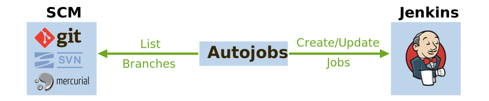

Introduction
============

This package provides a set of scripts that automatically create
Jenkins_ jobs from template jobs and the branches in a SCM repository.

The modus operandi of *jenkins-autojobs* is simple:

- Read :ref:`yaml configuration <gityamlconfig>` file.
- List branches from git, mercurial or subversion.
- Create or update jobs as specified in the config file. Jobs are
  updated whenever their template jobs change.

In a nutshell, the configuration file specifies:

- How to access Jenkins and the SCM repository.
- Which template job to use for which branch.
- Which branches to process and which to ignore.
- How new jobs should be named.

A non-exclusive list of other configuration options:

- The enabled/disabled state of new jobs. For example, we might want
  new jobs to inherit the state of their template jobs, but updated
  jobs to keep their most recent state.

- Perform text substitutions throughout all text elements of a job's
  ``config.xml``. This is useful for plugins that cannot introspect
  the name of the current branch or job (eg. `Sidebar-Link`_).

See example :ref:`git configuration file <gityamlconfig>` and the
corresponding :ref:`example output <exampleoutput>`

Supported SCMs
--------------

===============  =============================
 scm             script name
===============  =============================
 git_            ``jenkins-makejobs-git``
 subversion_     ``jenkins-makejobs-svn``
 mercurial_      ``jenkins-makejobs-hg``
===============  =============================

All scripts accept the same command-line options and arguments::

    Usage: jenkins-makejobs-* [-rvjnyoupUYOP] <config.yaml>

    General Options:
      -n dry run
      -v show version and exit

    Repository Options:
      -r <arg> repository url
      -y <arg> scm username
      -o <arg> scm password
      -Y scm username (read from stdin)
      -P scm password (read from stdin)

    Jenkins Options:
      -j <arg> jenkins url
      -u <arg> jenkins username
      -p <arg> jenkins password
      -U jenkins username (read from stdin)
      -P jenkins password (read from stdin)

Topics
------

.. toctree::
   :maxdepth: 2

   install
   git
   subversion
   mercurial
   devel
   changelog

Similar Projects
----------------

* jenkins-build-per-branch_
* jenkins-job-builder_

License
-------

*Jenkins-autojobs* is released under the terms of the `Revised BSD License`_.

.. _github:            https://github.com/gvalkov/jenkins-autojobs
.. _Jenkins:           http://jenkins-ci.org/
.. _`Revised BSD License`: https://raw.github.com/gvalkov/jenkins-autojobs/master/LICENSE
.. _lxml:              http://lxml.de/
.. _`Sidebar-Link`:    https://wiki.jenkins-ci.org/display/JENKINS/Sidebar-Link+Plugin
.. _python-jenkins:    http://pypi.python.org/pypi/python-jenkins
.. _jenkins-build-per-branch: http://entagen.github.com/jenkins-build-per-branch/
.. _jenkins-job-builder: https://pypi.python.org/pypi/jenkins-job-builder/
.. _git:               https://wiki.jenkins-ci.org/display/JENKINS/Git+Plugin
.. _subversion:        https://wiki.jenkins-ci.org/display/JENKINS/Subversion+Plugin
.. _mercurial:         https://wiki.jenkins-ci.org/display/JENKINS/Mercurial+Plugin
