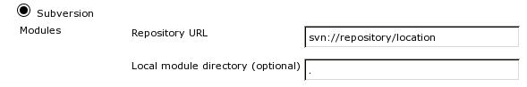

Subversion Setup
================

Jenkins
-------

The ``jenkins-makejobs-svn`` script works with template jobs
configured with the `Svn SCM`_ plugin. The relevant options
that must be set are:

The script will take care of setting the correct branch specifier (the
branch that the job should checkout) and the name of the local branch
for every new job created from the template job.

.. _svnyamlconfig:

Config file
-----------

.. literalinclude:: svn-config.yaml
   :language: yaml
.. :linenos:

:download:`Download svn-config.yaml <svn-config.yaml>`

``repo``
********

The base url for the project (not necessarily the repository root).

``branches``
************

Urls to list for branches that will be matchable by the refs_ option.

.. code-block:: yaml

    repo: 'file:///tmp/repo'
    branches:
      - 'file:///tmp/repo/branches/'
      - 'file:///tmp/repo/experimental/'
      - 'file:///tmp/repo/releases/'

``jenkins-makejobs-svn`` will list the contents of every specified url
and strip the value of ``repo``. The end result is a list similar to::

  branches/feature-one
  branches/feature-two
  experimental/john/bug-one
  releases/banana

``namefmt``
***********

Template string to use for job names.

Given a branch ``branches/svn-bisect``, the following table
maps the available placeholders to their respectful values:

=====================     =======================================
 placeholder                   value
=====================     =======================================
 ``{path}``                ``branches-svn-bisect``
 ``{path-orig}``           ``branches/svn-bisect``
 ``{branch}``              ``svn-bisect``
 ``{0}``                   ``svn``
 ``{1}``                   ``bisect``
=====================     =======================================

Assumes that the following config:

.. code-block:: yaml

    refs:
      - 'branches/(.*)-(.*)'
        namesep: '-'

Placeholders such as ``{0} {1} {2}`` evaluate to the
backreferences (``\1 \2 \3``) of the matching regular expression (see refs_).

.. note::

   Using ``path-orig`` would most likely result in an error, since
   some of the characters allowed in branch names cannot be used for
   job names.

``refs``
********

A list of regular expressions that specify the branches to process:

.. code-block:: yaml

    refs:
      - 'branches/feature-.*'
      - 'branches/bug-.*'

Global settings can be overwritten on a per-ref basis:

.. code-block:: yaml

    namefmt:  'job-{branch}'
    template: 'template-one'

    refs:
      - 'branches/feature-.*'
      - 'branches/bug-(.*)':
          namefmt:  'bug-{1}'
          template: 'bug-template'

=============================  ======================  ========================
ref                            new job name            template
=============================  ======================  ========================
``branches/bug-1``              ``bug-bug-1``           ``bug-template``
``branches/feature-1``          ``job-feature-1``       ``template-one``
=============================  ======================  ========================

Note that the namefmt_ setting can use backreferences from the regular
expressions through the ``{n}`` placeholder:

.. code-block:: yaml

    refs:
      - 'experimental/(.*)/(.*)'

Given a branch ``experimental/john/feature-one`` the placeholders will
be expanded as:

=============================  ======================
placeholder                    value
=============================  ======================
``{0}``                        ``john``
``{1}``                        ``feature-one``
=============================  ======================

Defaults to:

.. code-block:: yaml

    refs:
      - '.*'

``substitute``
**************

See :ref:`href-substitute`

.. _`Svn SCM`:         https://wiki.jenkins-ci.org/display/JENKINS/Subversion+Plugin
